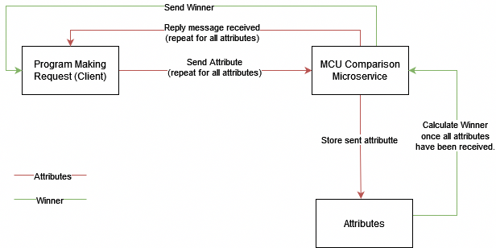

# How to REQUEST and RECIEVE data

In order to request data, the client will need to utilize ZeroMQ to connect to localhost:5555.

    zmq::context_t context (1);
    zmq::socket_t socket (context, zmq::socket_type::req);
    socket.connect ("tcp://localhost:5555");

Once connection is established, the client can send over data to be manipulated.
          
    socket.send (request, zmq::send_flags::none);

Then, the client can recieve a reply from the server.

     zmq::message_t reply;
     socket.recv (reply, zmq::recv_flags::none);

The client will send over a 11 strings that will be stored in an array on the server. Once stored, the data can be used to send a reply and to the client and obtain the necesarry information.

        

# Recipe-Finder
 An application that shows recipes based on available ingredients.

# Prerequisites
Python 3.12.2

# How to run
Unzip zip file.
Open CLI where zip was unzipped.
Run the following command:
    "python recipe_finder.py"

# Resources
https://docs.python.org/3/library/sqlite3.html

https://www.geeksforgeeks.org/how-to-execute-many-sqlite-statements-in-python/

https://www.onceuponachef.com/inspiration/basic-recipes-everyone-should-know.html

https://www.tasteofhome.com/collection/essential-recipes-you-should-know-by-35/

https://www.w3schools.com/sql/func_sqlserver_soundex.asp

https://stackoverflow.com/questions/59823203/how-can-i-define-the-width-of-a-column-prettytable-python

https://www.sqlite.org/spellfix1.html

https://zguide.zeromq.org/docs/

https://stackoverflow.com/questions/9445370/lists-or-dicts-over-zeromq-in-python

https://stackoverflow.com/questions/41918836/how-do-i-get-rid-of-the-b-prefix-in-a-string-in-python
